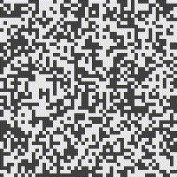

# Expaca

EXPeriments with Asynchronous Cellular Automata (Elixir)

There are two approaches to Cellular Automata:
- synchronous generations: all updates happen in a single global step,
  this is the usual formulation
- asynchronous evolution: updates happen according to some 
  non-deterministic but fair scheduler
  
Expaca is based on the idea of _Process Oriented Programming_ (POP):
* Algorithms are implemented using a fine-grain directed graph of 
  independent share-nothing processes.
* Processes communicate asynchronously by passing messages. 
* Process networks naturally run in parallel.

Every grid cell has its own fine grain asynchronous process,
which contains process IDs of its immediate neighbors,
so that they can exchange messages.



## 2D Grid
  
We will implement 2D rectangular grids,
but the approach could be extended to hexagonal,
or even unstructured grids.

In a 2D grid:
- integer (I,J) coordinate system
- dimension in each direction `{ni, nj}`
- total number of cells: `ncell = ni * nj`
- each cell has a location `{i, j}`
- indexes are 1-based, so `1 <= i <= ni`
  and `1 <= j <= nj`
  
Directions on a 2D grid can be described by either:
  - `{di, dj}` where values are `-1 | 0 | 1` and `{0,0}` is not allowed
  - compass direction: `:n | :ne | :e | :se | :s | :sw | : :w | :nw`
  
For Game of Life rules, we do not need detailed directional datastructures.
  
On a 2D grid there are 9 zones, where cells have a specific
topology of connections:
- NW corner: `1` cells, 3 neighbors (e, se, s)
- N edge: `ni-2` cells, 5 neighbors (e, se, s, sw, w)
- NE corner: `1` cells, 3 neighbors (s, sw, w)
- E edge: `nj-2` cells, 5 neighbors (s, sw, w, nw, n)
- SE corner: `1` cells, 3 neighbors (w, nw, n)
- S edge: `ni-1` cells, 5 neighbors (w, nw, n, ne, e)
- SW corner: `1` cells, 3 neighbors (n, ne, e)
- W edge: `nj-2` cells, 5 neighbors (n, ne, e, se, s)
- center: `(ni-2)*(nj-2)` cells, 8 neighbors (all directions)

There are two simple kinds of boundary conditions:
- assume zero occupancy outside the dimensions
  (clipped neighborhoods, as given above)
- cyclic boundary condition, where the boundary is the opposite edge
  (modulo arithmetic for cell locations)
  
We will initially implement zero occupancy boundary.

## Cell State

We use a simple binary state:
- `false`: empty
- `true`: occupied

## Grid State

A _frame_ is a completed step for all cells.

There are two frame representations:
- internal `Frame`: set of locations that are occupied;
  empty locations are not present in the set
- ASCII string rendered using:
  - `'.'` empty
  - `'X'` occupied
  - `'\n'` end of row
- `Exa.Image.Bitmap` which can be converted to ASCII string or Exa images

For example, a glider...

frame set representation:

```
  MapSet: [ {1,2}, {2,2}, {3,2}, {3,3}, {2,4} ]
```

ASCII art version:

 ```
  \"\"\"
  .X..
  ..X.
  XXX.
  ....
  \"\"\"
  ```

A set is used internally for frames, 
because in Game of Life, the occupancy tends to be sparse,
so the set will usually be small.

## Update Rule

The same update rule is used for all cells (homogeneous).

There are two kinds of update rules:
- simple counts of neighboring states;
  isotropic behavior (e.g. no distinction between 
  face-adjacent and diagonal-adjacent neighbors);
  neighbors can be unordered unlabelled list
- directional rules; neighbors must be 
  labelled with directions from the cell

We will initially use the classic update rule 
from Conway's Game of Life (GoL), which uses simple counts:
- any cell with 3 occupied neighbors, stays or becomes occupied
- a live cell with 2 occupied neighbors stays alive

## Output Format

The frames for individual steps are returned as `Exa.Image` bitmaps.
The utilities in `Exa.Image.Bitmap` can be used to:
- convert to ASCII strings
- convert to 1- or 3-byte images
- write the images to file

Then use `Exa.Image.Video` to make a video, 
if you have [ffmpeg](https://ffmpeg.org/download.html) 
installed on the system path.

See the test suite for examples.

## Synch CA

Even though the topic of the repo is Asynch CA, 
we will begin with Synch CA.

There is still one process for every cell,
so we have to introduce synchronization mechanisms 
to execute the grid update in lockstep.

Each cell will have the following state:
- location in the grid
- collection of neighbor process addresses 
- previous state (boolean)
- generation number for previous state  
- accumulated messages of neighboring state to calculate a new state
- some counters counting down to zero, 
  for cell update and end of simulation

The previous state is known to be complete for all cells.

The current generation counts down to 0,
so the next generation is just previous generation - 1.

There are two types of process:
- grid manager (one instance)
  - spawns and controls the cells
  - receives updates from cells and builds result frames
  - sends completed frames to the client
  - exits after some number of generations
- cell worker (`ni*nj` instances)
  - multistage initialization of state
  - start processing
  - send state to each neighbor
  - receive state from each neighbor
  - update cell value and roll generation
  - notify manager and neighbors of completed state value
  - exit after some number of generations

## Asynch CA

An Asynchronous CA evolves without any globally synchronized 
cell steps or frame steps.

Each cell maintains a copy of their neighborhood state.
Any neighborhood change event triggers a new state for the cell.
The cell broadcasts any new change to all its neighbors
and the grid manager.

Cell changes are serialized through the grid manager, 
in some non-deterministic (but fair) sequence.

The grid manager generates a new frame for _every_ cell change,
so the output frame rate is much higher than in the synchronized case.

### Asynchronous Execution

Overall behavior should be _fair_
so that no particular cells or regions of the grid
are favored, or disfavored.

The Erlang BEAM runtime is designed to be fair.

Cell processes will be distributed across all
hardware threads, managed by one scheduler per thread (by default).
There is no concept of locality 
when assigning cells to threads (schedulers).
The grid is not spatially partitioned.
Assignment is non-deterministic, 
which means most messages between neighborhood cells
will be between threads (inefficient). 

If it were possible to partition the grid
and pin cells to specific threads,
local evolution would be faster,
but the thread boundaries might appear 
as artifacts in the output,
as regions evolve faster than cross-border changes.

Cells will naturally block, waiting for new changes to the neighborhood. 
Pathological behavior may occur
when local cycles of cells trigger each other 
(e.g. traffic light blinker).
The BEAM must be fair enough to prevent local cycles
from starving other regions of active cells.

Asynch CA appears to evolve at random,
but the random number generator is 
deterministic, given the original seed.

